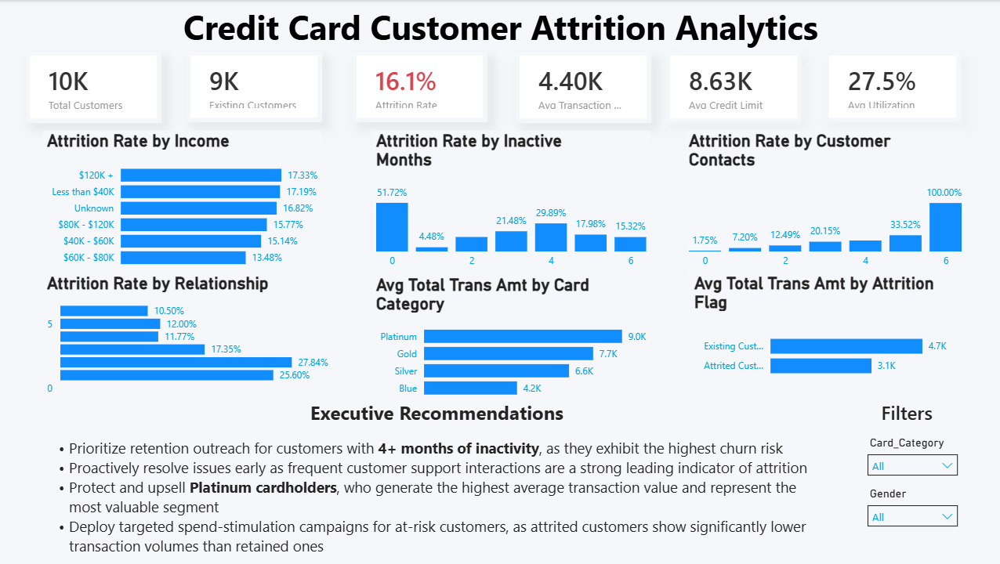

# Credit Card Customer Attrition Analytics

## Overview

This project analyzes customer attrition for a credit card company using SQL and Power BI. The objective was to identify the major factors contributing to customer churn and present actionable business insights through an executive dashboard.

The project simulates an end-to-end analytics workflow, including data cleaning, validation, exploratory SQL analysis, KPI development, dashboard creation, and business recommendations.

---

## Dataset

- **Dataset:** BankChurners
- **Records:** 10,127 Customers
- **Tools Used:** MySQL, Power BI, DAX

---

## Project Workflow

### 1. Database Creation

- Created MySQL database
- Imported customer data using `LOAD DATA INFILE`
- Removed unnecessary Naive Bayes prediction columns

### 2. Data Validation

Performed validation including:

- Row count verification
- Duplicate detection
- NULL value checks
- Category validation

### 3. Exploratory Data Analysis

Analyzed customer attrition across:

- Gender
- Income Category
- Education Level
- Card Category
- Customer Support Contacts
- Months Inactive
- Total Relationship Count
- Credit Utilization
- Age Groups
- Customer Spending Patterns

### 4. Power BI Dashboard

Built an executive dashboard featuring:

- KPI Cards
- Attrition Analysis
- Customer Behavior Analysis
- Customer Value Analysis
- Business Recommendations
- Interactive Slicers

---

# Dashboard Preview



---

# Key Insights

- Overall customer attrition rate is **16.1%**
- Customer inactivity is one of the strongest indicators of churn.
- Repeated customer support interactions strongly correlate with attrition.
- Customers with multiple banking products exhibit significantly higher retention.
- Attrited customers have substantially lower transaction amounts.
- Premium cardholders generate the highest business value.

---

# Business Recommendations

- Launch proactive retention campaigns for inactive customers.
- Improve customer support resolution quality.
- Cross-sell additional banking products to strengthen customer relationships.
- Monitor declining transaction activity as an early warning indicator of churn.

---

# Project Structure

```
Credit-Card-Customer-Attrition-Analytics
│
├── Dashboard
│   ├── credit_card_analytics.pbix
│   └── Dashboard.png
│
├── Data
│   └── BankChurners.csv
│
├── SQL
│   ├── 01_database_setup.sql
│   ├── 02_data_validation.sql
│   └── 03_exploratory_analysis.sql
│
└── README.md
```

---

# Skills Demonstrated

- SQL (MySQL)
- Data Cleaning
- Data Validation
- Exploratory Data Analysis (EDA)
- Business Analytics
- Power BI
- DAX
- Dashboard Design
- Data Visualization

---

## Author

**Saransh**
